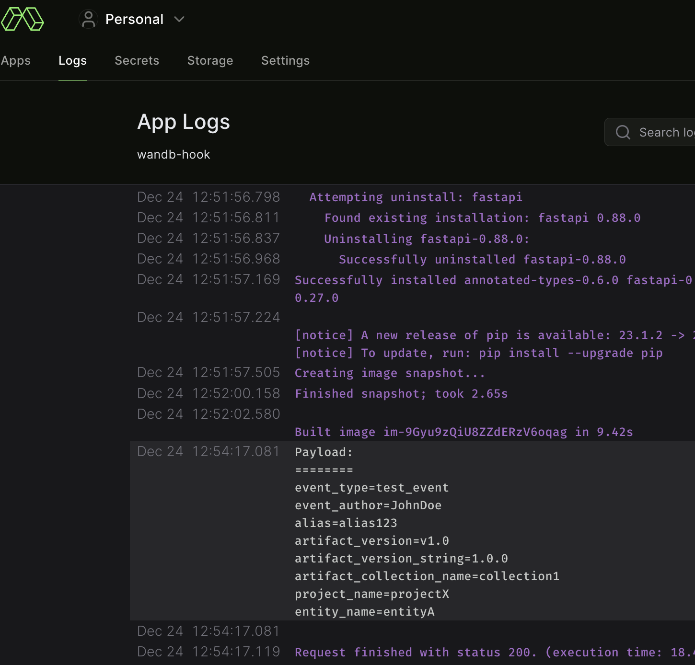
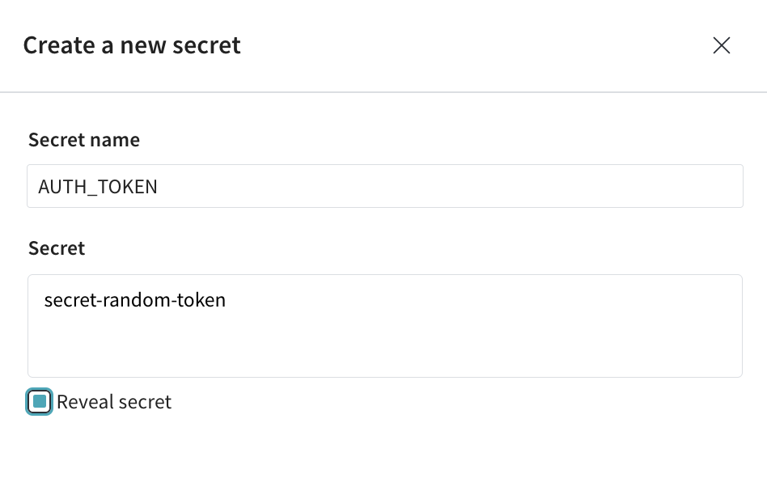
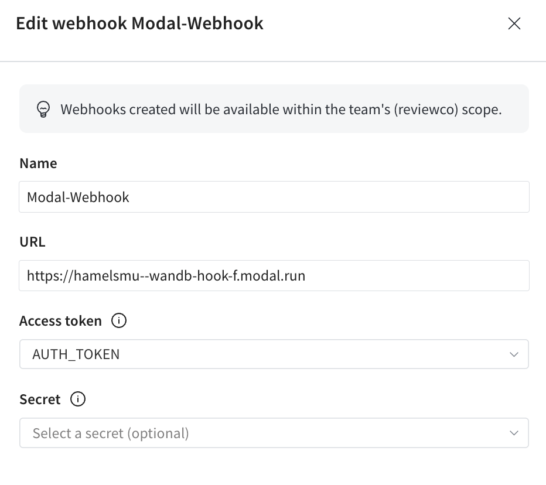
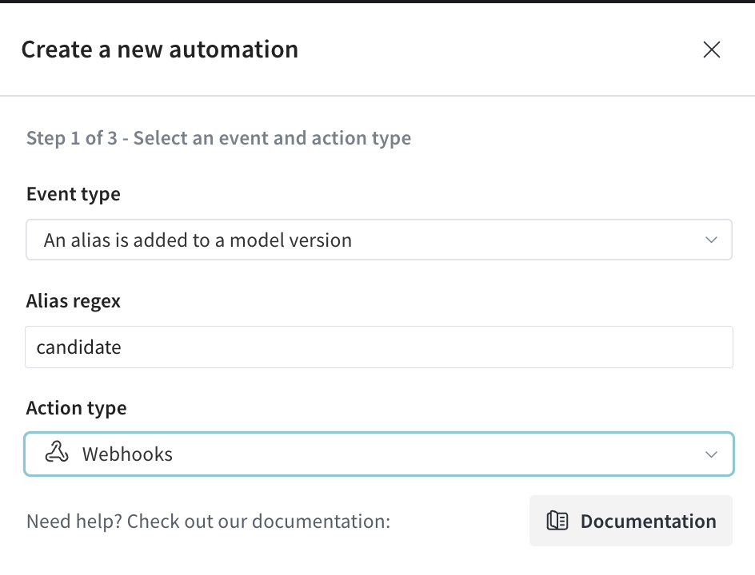
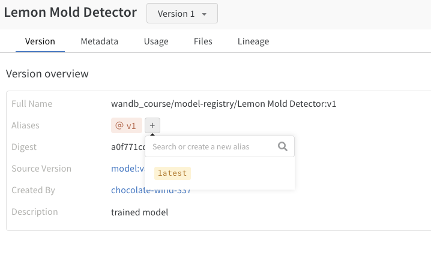
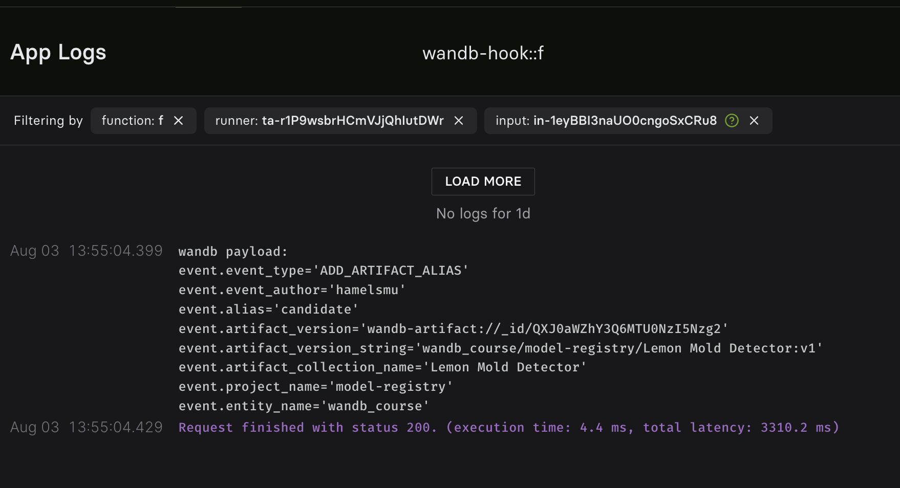

# W&B Modal Web Hooks
> Setup a webhook that integrates the W&B model registry w/ [Modal Labs](https://modal.com/).

Webhooks are a nice way to trigger external applications to perform some action.  This is an example that receives a webhook when you change a tag on a model in a Weights & Biases model registry.  [This document](https://wandb.ai/wandb/wandb-model-cicd/reports/Model-CI-CD-with-W-B--Vmlldzo0OTcwNDQw) describes how to setup W&B webhooks with GitHub Actions. However, I think it is more useful to show how this might work with Modal Labs, because Modal is:

1. Faster
2. You have access to GPUs
3. More ergonomic (you can locally debug, easier to use)

## Instructions

1. Setup

    ```bash
    pip install modal
    pip install -U modal-client
    ```

1. Setup a [modal secret](https://modal.com/secrets) with the name `my-random-secret`  with the following fields:

    - Key: `AUTH_TOKEN`
    - Value: `secret-random-token`

1. Create a [modal webhook](https://modal.com/docs/guide/webhooks) by running the following command from the root of this repo: 

    ```bash
    modal deploy server.py
    ```

    You will get an endpoint that you need to use in the next step.  This url will look something like ` https://hamelsmu--wandb-hook-f.modal.run`

    Also you will get a deployment url that will look something like `https://modal.com/apps/hamelsmu/wandb-hook` - you can use this to see the logs of your webhook.

2. Test the webhook by running the following command:
    
    ```
    ./curl.sh <your-modal-url>
    ```
    You should see the following response locally:

    ```
    {"message":"Event processed successfully"}
    ```
    Open your modal deployment url and you should see something like this on the logs tab:

    

3. Create a secret in your wandb team settings with the name `AUTH_TOKEN` and value `secret-random-token`

    

5. Create a new [W&B Webhook](https://docs.wandb.ai/guides/model_registry/automation#configure-a-webhook) in your team settings. Set the url to the one you got in the previous step, and the `Access token` to the `AUTH_TOKEN`.

    

6. Create a new [webhook automation](https://docs.wandb.ai/guides/model_registry/automation#add-a-webhook) in your team's model registry: Set the trigger to `an artificat alias is added` and set the Alias regex to `candidate`.  

    


    Next, set the following payload:

    ```json
    {
    "event_type": "${event_type}",
    "event_author": "${event_author}",
    "alias": "${alias}",
    "artifact_version": "${artifact_version}",
    "artifact_version_string": "${artifact_version_string}",
    "artifact_collection_name": "${artifact_collection_name}",
    "project_name": "${project_name}",
    "entity_name": "${entity_name}"
    }
    ```

    

7. Trigger the payload

    The easiest way to trigger the payload is to go to the model registry and add an alias 

    

    type in `candidate`.  This will trigger the webhook.  

> [!IMPORTANT]
> Make sure you spell `candidate` correctly, otherwise the webhook won't trigger!

8. Check the logs. Go to the [logs for your modal webhook](https://modal.com/logs) and you should see something like this:

    

9. Do stuff!  You can do tasks like:
    - Download the appropriate model from the registry based on the webhook payload and test/run it.
    - Push the model to an inference server or update a Modal deployment.
    - Send a [Slack message](https://modal.com/docs/guide/ex/stable_diffusion_slackbot#slack-webhook) to a channel.

## Further reading

### Modal

1. [Webhooks](https://modal.com/docs/guide/webhooks)
2. [Web endpoint](https://modal.com/docs/guide/webhook-urls)
3. [Slack web hook](https://modal.com/docs/guide/ex/stable_diffusion_slackbot#slack-webhook)


### W&B Webhooks

[W&B Webhooks](https://wandb.ai/wandb/wandb-model-cicd/reports/Model-CI-CD-with-W-B--Vmlldzo0OTcwNDQw)


